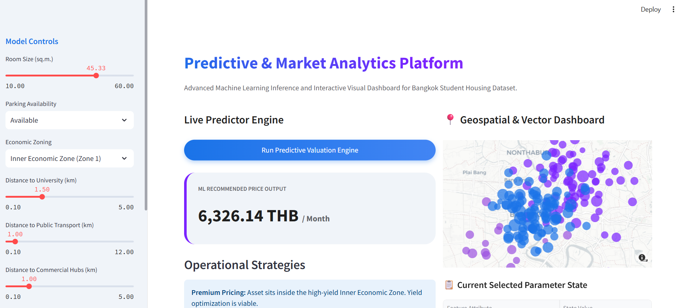
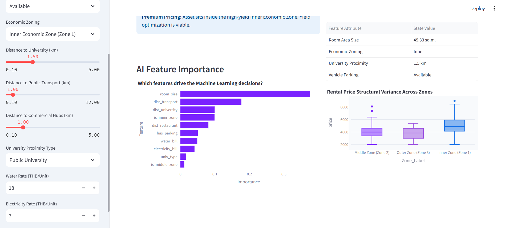

#  Automated Rental Pricing Optimization Platform

An Enterprise Data Science Platform for Automated Property Valuation in the Bangkok Metropolitan Area using Random Forest.

---

An end-to-end Data Science and Predictive Analytics web application designed to automate property valuation and maximize rental yield for student housing near major universities in Bangkok. 

This project successfully bridges the gap between traditional econometric research and scalable machine learning web products.

##  From Academic Research to Data Product (Bridging the Gap)
Traditional quantitative research papers often stop at proving statistical significance inside a static document. This project actively extracts those academic insights to solve real-world industry bottlenecks:

1. **Overcoming Static Limitations:** In my senior thesis, traditional **Stepwise Linear Regression** was utilized to find market factors. While excellent for inference, it was heavily constrained by rigid assumptions (linearity, multicollinearity issues with zoning) and couldn't scale for dynamic real-time production.
2. **Translating Insights into Business Value:** Property operators cannot optimize pricing by reading regression tables. By upgrading the framework into a non-linear **Random Forest Regressor** and embedding it inside an interactive **Streamlit web application**, this project transforms raw econometric findings into a self-service **Automated Valuation Model (AVM)**.
3. **Data-Driven Strategy Automation:** Academic recommendations regarding "distance decay" and "amenity premiums" are completely automated in this web engine. The app dynamically serves tailored business strategies (e.g., *Unbundled Pricing, Shuttle Bus implementations*) instantly as users tweak property attributes.

## Dynamic Dashboard Prototype
*Built using Streamlit and styled with a clean Google Gemini enterprise-level interface.*

### Key Features
- **Live Predictive Valuation Engine:** Input dynamic parameters (room size, economic zoning, utility rates, and campus proximity) to infer fair market rental prices instantaneously.
- **Geospatial Profiling:** Interactive Mapbox layer mapping property density and price scale across different Bangkok economic hubs.
- **Explainable AI Metric:** Visualized Feature Importance chart demonstrating exactly which underlying attributes drive the model's pricing decisions.

##  Technical Architecture & Benchmarking
The dataset consists of 200 meticulously surveyed student accommodation units. The modeling architecture shifted from traditional linear equations to resilient machine learning algorithms:

- **Baseline Model:** Traditional Stepwise Linear Regression achieved an Adjusted $R^2$ of `0.410`.
- **Challenger Model:** Upgraded to a non-linear **Random Forest Regressor** pipeline, increasing predictive strength to an **$R^2$ of `0.552`**.
- **Business Impact:** The Machine Learning deployment successfully **reduced the Mean Absolute Error (MAE) by ~140 THB per unit** (dropping average error from 865 THB down to 725 THB), significantly providing a tighter, more reliable pricing algorithm for digital rental platforms.

##  Academic Research Paper & Documentation
The underlying quantitative research framework, data dictionary, and econometric methodology are based on my senior research project: **"Factors Influencing Student Housing Rental Prices in Bangkok"**. 

The full research paper, data dictionary, and experimental Jupyter Notebook (`.ipynb`) are included in this repository for academic verification and end-to-end transparency.

##  Tech Stack & Libraries Used
- **Language:** Python
- **Core Framework & UI:** Streamlit, HTML/CSS Integration
- **Data Engineering:** Pandas, NumPy
- **Machine Learning Architecture:** Scikit-Learn (Random Forest Regressor)
- **Data Visualization Engine:** Plotly Express
